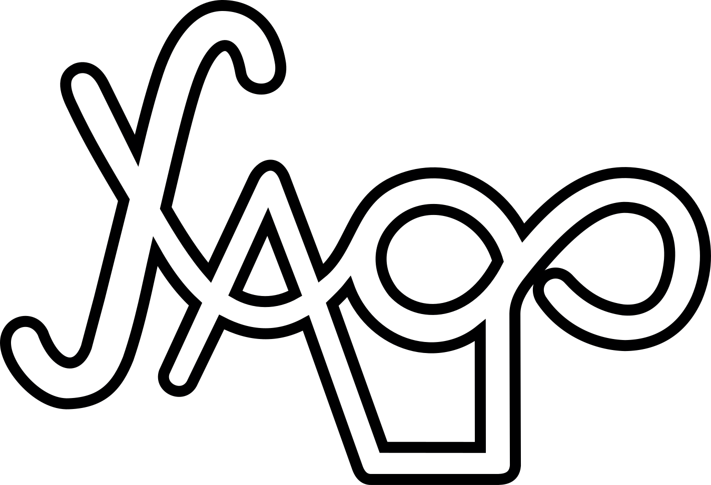

  

<h1 align="center">Yago Pereira | Desenvolvedor Web Front-end</h1>

Este projeto foi desenvolvido não apenas para divulgar minhas habilidades e experiências profissionais, mas também colocar em prática tudo o que venho aprendendo constantemente.

| :placard: Vitrine.Dev |     |
| -------------  | --- |
| :sparkles: Nome        | **Portfolio**
| :label: Tecnologias | HTML, CSS, Javascript (tecnologias utilizadas)
| :rocket: URL         | https://yapeansa.github.io/portfolio/
| :fire: Desafio     | https://yapeansa.vercel.app/

<h2 align="center">Imagem do projeto</h2>

### Breve Descrição do Projeto

Utilizando as linguagens HTML5, CSS3 e Javascript, exploro no decorrer do desenvolvimento conceitos importantes de diagramação e posicionamento de elementos no documento, tais como Flexbox e Grid. Além disso, a responsividade também foi trabalhada neste projeto.

### Tecnologias Utilizadas

  &nbsp;
  &nbsp;
  &nbsp;
  

### Acesso ao Projeto

Você pode acesar a página do projeto clicando nos seguintes links:

- [https://yapeansa.github.io/portfolio/](https://yapeansa.github.io/portfolio/)
- [https://yapeansa.vercel.app/](https://yapeansa.vercel.app/)

### Desenvolvedor do Projeto

[    Yago Pereira ](https://github.com/yapeansa) |
| :---: |  

<h2 align="center">Contato</h2>

Não se esqueça de me seguir em minhas redes sociais:

     
  

